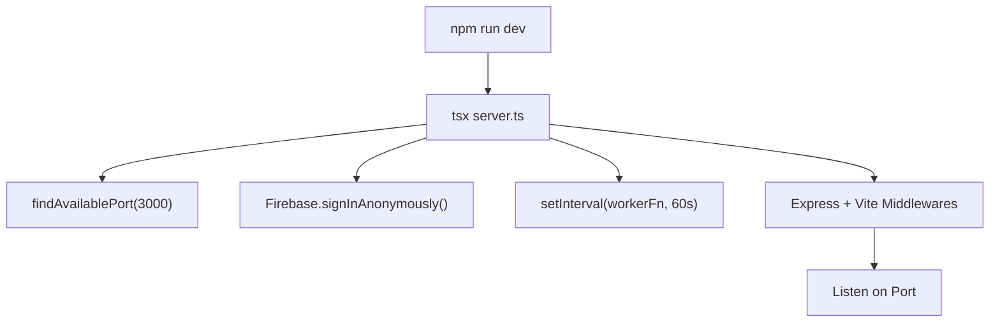
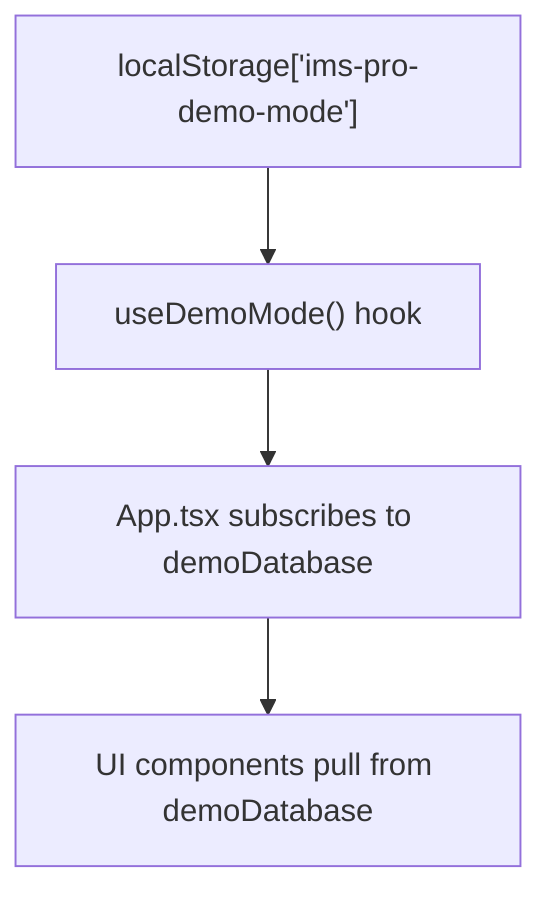
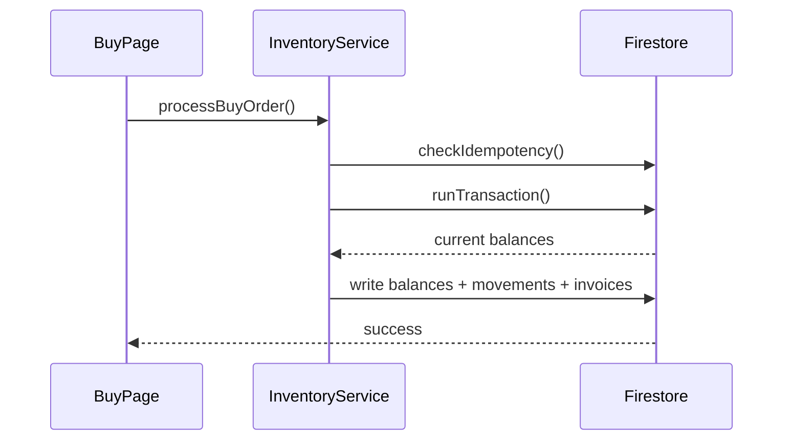
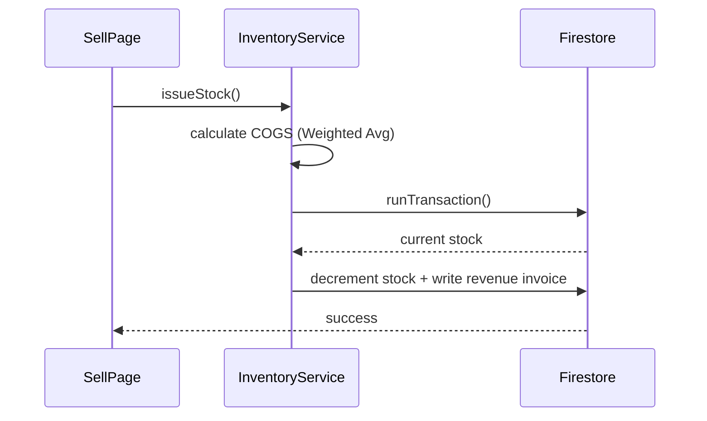
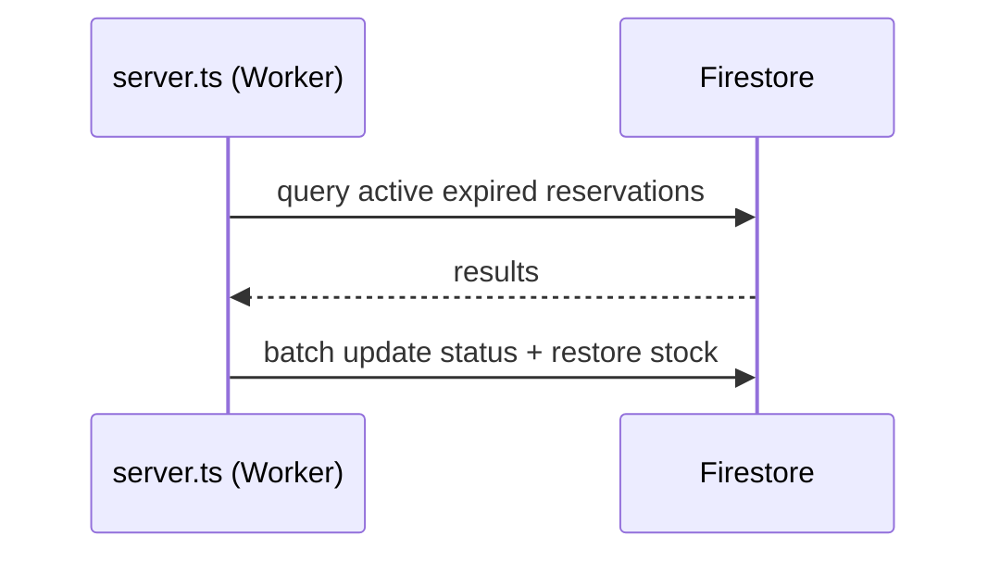

# IMS-Pro — Full Architecture & Code Reference

> [!ABSTRACT] 
> **Inventory Management System** — AI-powered, real-time, multi-role, Firebase-backed.
> Reading this file start-to-finish will give you a complete mental model of the entire project.

#ims-pro #architecture #firebase #react #gemini-api

---

## 🗂️ Table of Contents

- [[#Project Overview]]
- [[#Technology Stack]]
- [[#Directory Structure]]
- [[#Entry Points]]
  - [[#server.ts — Dev Server + Background Worker]]
  - [[#src/main.tsx — React Bootstrap]]
  - [[#src/App.tsx — Router & Global State]]
- [[#Data Layer]]
  - [[#Firebase & Firestore]]
  - [[#Firestore Collections Reference]]
  - [[#src/types.ts — TypeScript Interfaces]]
- [[#Core Business Logic]]
  - [[#src/services/inventoryService.ts]]
- [[#AI Integration (Gemini API)]]
- [[#Pages (Role Dashboards & Reports)]]
- [[#Components]]
  - [[#Layout.tsx]]
  - [[#MasterDataPage.tsx]]
  - [[#BuySellPanel.tsx]]
  - [[#SearchableSelect & AutocompleteSearch]]
  - [[#Dashboard Components]]
- [[#Library Utilities (src/lib/)]]
- [[#Demo Mode (src/demo/)]]
- [[#Data Flow Diagrams]]
- [[#Key Patterns & Conventions]]

---

## Project Overview

IMS-Pro is a **single-page web application** for inventory management. It supports multiple user roles (Admin, Manager, Procurement, Inventory Worker), tracks stock across multiple warehouses, handles buying from suppliers, selling to clients, inter-warehouse transfers, returns, and provides a full accounting suite (P&L, cash flow, VAT, aged receivables/payables).

A background worker on the server periodically expires stale **stock reservations**, restoring the reserved quantity back to available stock.

---

## Technology Stack

| Layer          | Technology                          |
| -------------- | ----------------------------------- |
| Frontend UI    | React 19, Vite 6                    |
| Styling        | Tailwind CSS 4                      |
| Animation      | Framer Motion                       |
| Icons          | Lucide React                        |
| Charts         | Recharts                            |
| Notifications  | Sonner (toast)                      |
| Routing        | React Router DOM v7                 |
| AI             | Google Gemini API (`@google/genai`) |
| Backend/Worker | Express + tsx (Node.js)             |
| Language       | TypeScript                          |

---

## Directory Structure

```
IMS-pro/
├── server.ts                  # Express dev server + background worker
├── index.html                 # Vite HTML shell
├── vite.config.ts             # Vite configuration
├── tsconfig.json              # TypeScript config
├── package.json               # Scripts & dependencie
│
└── src/
    ├── main.tsx               # React root mount (renders <App/>)
    **├── App.tsx                #** Router definitions + global Firestore listeners
    ├── index.css              # Global styles (Tailwind base + custom tokens)
    ├── types.ts               # All TypeScript interfaces & type aliases
    │
    ├── services/
    │   └── inventoryService.ts  # Core inventory CRUD with Firestore transactions
    │
    ├── lib/
    │   ├── accountingReports.ts  # Pure functions for P&L, aging, cash flow, VAT
    │   ├── accountingReports.test.ts  # Node test runner tests for accounting                                                                              logic
    │   ├── clientFinancials.ts   # Client balance / credit logic helpers
    │   ├── fileExports.ts        # Excel (HTML table) & PDF export utilities
    │   ├── financialGuards.ts    # Input sanitization / validation helpers
    │   ├── firestore-errors.ts   # Firestore error code helpers
    │   ├── seed.ts               # Data seeding script (populates demo Firestore)
    │   ├── syncPause.ts          # Utility to pause/resume Firestore real-time sync
    │   └── utils.ts              # Generic helpers (e.g. cn() for class merging)
    │
    ├── pages/
    │   ├── InventoryDashboard.tsx   # Main dashboard (stock levels, charts,KPIs)
    │   ├── AdminDashboard.tsx       # Admin-only: user management, system config
    │   ├── ManagerDashboard.tsx     # Manager: warehouse overview, approvals
    │   ├── ProcurementDashboard.tsx # Procurement: POs, supplier management
    │   ├── BuyPage.tsx              # Buy stock (from supplier + warehouse allocation)
    │   ├── SellPage.tsx             # Sell stock to clients
    │   ├── ReturnPage.tsx           # Process returns (sales or purchases)
    │   ├── WarehouseExpensesPage.tsx # Log & track warehouse expenses
    │   ├── AccountingPage.tsx       # Accounting reports (tabs: P&L, Aged, Cash Flow, VAT)
    │   ├── CogsReportPage.tsx       # COGS breakdown report
    │   ├── NetProfitPage.tsx        # Net profit report
    │   ├── StockMovementHistory.tsx # Full audit log of stock movements
    │   ├── ClientTransfersPage.tsx  # Per-client transaction history
    │   ├── ClientPaymentsPage.tsx   # Per-client payment ledger
    │   ├── SupplierTransfersPage.tsx # Per-supplier purchase history
    │   ├── EntityReportPage.tsx     # Generic drilldown for any entity (product, brand, etc.)
    │   └── ProfilePage.tsx          # User profile settings
    │
    ├── components/
    │   ├── Layout.tsx               # App shell (sidebar, topbar, auth guard)
    │   ├── MasterDataPage.tsx       # Generic CRUD table for any Firestore collection
    │   ├── BuySellPanel.tsx         # Reusable buy/sell form panel
    │   ├── AutocompleteSearch.tsx   # Debounced text search input + dropdown
    │   ├── SearchableSelect.tsx     # Dropdown with filterable options
    │   └── dashboards/              # Dashboard sub-components (charts, KPI cards)
    │       └── WarehouseStaffDashboard.tsx # Specific views for warehouse workers
    │
    └── demo/
        ├── demoMode.ts       # Toggle demo mode on/off (localStorage + React hook)
        ├── demoData.ts       # Static seed data for demo entities
        ├── demoDatabase.ts   # In-memory mock Firestore (all CRUD operations)
        ├── demoProfile.ts    # Mock authenticated user profile
        └── DemoApp.tsx       # Demo mode wrapper component
```

---

## Entry Points

### `server.ts` — Dev Server + Background Worker

This file is the **single entry point** for development (`npm run dev` runs `tsx server.ts`).

It does **three things** in sequence:

#### 1. Port Detection
Uses a TCP probe to find a free port, starting from `3000`. HMR uses the next available port.

#### 2. Background Reservation Worker
- Signs into Firebase **anonymously** (so security rules can permit server operations).
- Runs a `setInterval` every **60 seconds**:
  - Queries `reservations` collection for documents where `status == 'active'` and `expiry_timestamp < now`.
  - For each expired reservation:
    1. Marks the reservation as `expired`.
    2. Restores the reserved quantity to `inventory_balances.available_quantity`.
    3. Writes a `stock_movements` record of type `adjustment` for audit trail.
  - All three writes happen in a single **Firestore batch** (atomic).

#### 3. Vite Dev Server
- In **development**: attaches Vite's middleware to Express for HMR and SPA routing.
- In **production**: serves the built `dist/` folder and falls back to `index.html` for all routes.



---

### `src/main.tsx` — React Bootstrap

```tsx
// Mounts <App /> into #root, wraps with <Toaster /> for toast notifications
ReactDOM.createRoot(document.getElementById('root')).render(<App />)
```

---

### `src/App.tsx` — Router & Global State

`App.tsx` is the top-level React component. It does two critical jobs:

#### 1. Global Real-time Data Subscriptions

When a user logs in (`onAuthStateChanged`), `App.tsx` opens **Firestore `onSnapshot` listeners** for these collections:

| Collection | State Variable | Used For |
|---|---|---|
| `brands` | `brands` | Brand dropdown options sitewide |
| `categories` | `categories` | Category dropdown options |
| `products` | `products` | Product dropdown options |
| `suppliers` | `suppliers` | Supplier dropdown options |
| `clients` | `clients` | Client dropdown options |
| `users` | `users` | User/Manager assignments |

These listeners are **closed and re-opened** on every auth state change, and cleaned up on logout.

In **demo mode**, data is pulled from the in-memory `demoDatabase` instead of Firestore.

#### 2. SPA Route Definitions

All routes are nested under a single `<Layout />` wrapper (handles auth guard, sidebar, topbar).

| URL Path | Component |
|---|---|
| `/` | `InventoryDashboard` |
| `/inventory/warehouses` | `MasterDataPage` (warehouses) |
| `/inventory/clients` | `MasterDataPage` (clients) |
| `/inventory/suppliers` | `MasterDataPage` (suppliers) |
| `/inventory/brands` | `MasterDataPage` (brands) |
| `/inventory/categories` | `MasterDataPage` (categories) |
| `/inventory/products` | `MasterDataPage` (products) |
| `/inventory/variants` | `MasterDataPage` (product_variants) |
| `/buy` | `BuyPage` |
| `/sell` | `SellPage` |
| `/return` | `ReturnPage` |
| `/expenses` | `WarehouseExpensesPage` |
| `/cogs` | `CogsReportPage` |
| `/net-profit` | `NetProfitPage` |
| `/accounting/profit-loss` | `AccountingPage` (P&L) |
| `/accounting/aged-receivable` | `AccountingPage` (Aged Receivable) |
| `/accounting/aged-payable` | `AccountingPage` (Aged Payable) |
| `/accounting/cash-flow` | `AccountingPage` (Cash Flow) |
| `/accounting/tax-report` | `AccountingPage` (VAT) |
| `/reports/movements` | `StockMovementHistory` |
| `/clients/:id/transfers` | `ClientTransfersPage` |
| `/clients/:id/payments` | `ClientPaymentsPage` |
| `/suppliers/:id/transfers` | `SupplierTransfersPage` |
| `/warehouses/:id/details` | `EntityReportPage` |
| `/profile` | `ProfilePage` |

---

## Data Layer

### Firebase & Firestore

Firebase is initialized in `src/firebase.ts` using credentials from `firebase-applet-config.json`.

```ts
// src/firebase.ts
import { initializeApp } from 'firebase/app';
import { getFirestore } from 'firebase/firestore';
import { getAuth } from 'firebase/auth';

export const app = initializeApp(firebaseConfig);
export const db = getFirestore(app, firestoreDatabaseId);
export const auth = getAuth(app);
```

Real-time data uses `onSnapshot`. Write operations use Firestore **transactions** (`runTransaction`) or **batches** (`writeBatch`) for atomicity.

---

### Firestore Collections Reference

| Collection | Purpose |
|---|---|
| `brands` | Brand master data |
| `categories` | Category master data |
| `products` | Product master data |
| `product_variants` | SKU/barcode-level variants |
| `warehouses` | Warehouse master data |
| `suppliers` | Supplier master data |
| `clients` | Client master data + financial balances |
| `users` | System user profiles |
| `inventory_balances` | Stock levels per variant per warehouse |
| `stock_movements` | Audit log of all inventory changes |
| `reservations` | Active/expired stock reservations |
| `transfers` | All buy/sell/transfer transactions (unified log) |
| `revenue_invoices` | Sales invoices |
| `purchase_invoices` | Purchase/buy invoices |
| `transfer_invoices` | Warehouse-to-warehouse transfer invoices |
| `return_invoices` | Return invoices |
| `client_payments` | Payment ledger (incoming & outgoing) |
| `warehouse_expenses` | Operating expenses per warehouse |
| `inventory_update_records` | Idempotency log for buy-order operations |
| `supplier_product_relations` | Supplier ↔ product purchase history |

---

### `src/types.ts` — TypeScript Interfaces

All data models are typed in a single file. Key types:

```ts
// Inventory tracking
interface InventoryBalance {
  variant_id: string; warehouse_id: string;
  available_quantity: number; reserved_quantity: number;
  blocked_quantity: number; version: number; last_modified: string;
}

// Movement types
type MovementType = 'receipt' | 'issue' | 'transfer_out' | 'transfer_in' | 'adjustment' | 'return';
type MovementStatus = 'pending_qc' | 'completed' | 'rejected' | 'pending_inspection';

// Reservation lifecycle
type ReservationStatus = 'active' | 'committed' | 'expired' | 'released';

// Invoice types
interface RevenueInvoice { /* sales invoices with COGS, gross profit */ }
interface ReceiptInvoice  { /* purchase/goods receipt invoices */ }

// Expenses
interface WarehouseExpense { recurrence: 'monthly' | 'one_time'; ... }
```

The `version` field on `InventoryBalance` is incremented on every write — this enables **optimistic concurrency** inside transactions.

---

## Core Business Logic

### `src/services/inventoryService.ts`

This is the **heart of the application**. All stock-altering operations MUST go through this service — never write directly to Firestore outside of it.

Every public method follows this pattern:
1. **Validate** inputs (positive quantity, valid money values).
2. **Check idempotency** — reject if the same `idempotency_key` was already processed.
3. **Fetch document refs** (balances, movements, invoices).
4. **Run a Firestore transaction** — reads current state, validates business rules (e.g. sufficient stock), then atomically writes all changes.

#### `InventoryService.receiveStock()`
> Adds stock from a supplier delivery.

- Increments `inventory_balances.available_quantity`.
- Writes a `stock_movements` record (`movement_type: 'receipt'`).

#### `InventoryService.issueStock()`
> Sells stock to a customer (SellPage).

- Validates `available_quantity >= quantity`.
- Decrements `inventory_balances.available_quantity`.
- Calculates: `subtotal`, `vatAmount`, `total`, `paidAmount`, `cogsAmount` (using weighted average cost), `grossProfit`.
- Writes:
  - `stock_movements` (`issue`)
  - `revenue_invoices`
  - `transfers` (type: `sell`)
  - `client_payments` (if payment > 0)
  - Updates `clients` document (balance_due, paid_amount, etc.)

#### `InventoryService.transferStock()`
> Moves stock between two warehouses.

- Atomic: decrements source, increments destination.
- Writes two `stock_movements` (`transfer_out` + `transfer_in`).
- Writes `transfer_invoices` and `transfers` records.

#### `InventoryService.processBuyOrder()`
> Complex: handles the BuyPage "buy for client" flow.

This is the most complex operation. It can simultaneously:
1. Allocate existing stock from **one or more warehouses** to a client.
2. Receive **new supplier stock** into a receiving warehouse.

It validates that `total_from_warehouses + supplier_quantity == requested_quantity`.

Writes (all in one transaction):
- Updated `inventory_balances` for each affected warehouse
- Multiple `stock_movements` (issue per warehouse + receipt from supplier)
- `purchase_invoices`
- `transfers` (type: `buy_order`)
- `inventory_update_records` (idempotency record)
- `supplier_product_relations`

---

## AI Integration (Gemini API)

> [!INFO]
> IMS-Pro leverages the **Google Gemini API** (`@google/genai`) to provide intelligent stock management features.

### Implementation Details
- **Provider**: Google Gemini Flash (v1.5)
- **Key Location**: `.env.local` -> `GEMINI_API_KEY`
- **Core Functions**:
  - **Demand Forecasting**: Analyses `stock_movements` history to predict upcoming stock requirements.
  - **Inventory Insights**: Generates natural language summaries of dashboard KPIs.
  - **Automated Categorization**: Suggests product categories based on SKU and description.

---

## Pages (Role Dashboards & Reports)

### `InventoryDashboard.tsx` (~3,200 lines)
The largest file. Serves as the **main landing page**. Contains:
- Real-time KPI cards (total stock, low stock alerts, reservations).
- **AI Insights Panel**: Uses Gemini to summarize current stock health.
- Charts (stock by warehouse, movement history trends).
- Quick action buttons (link to Buy/Sell/Transfer).
- Inline stock-level table with search & filter.

### `BuyPage.tsx`
Buy stock for a client. UI flow:
1. Select client, product variant, quantity.
2. System shows current stock per warehouse.
3. User allocates quantities from existing warehouses.
4. Remaining quantity filled by supplier (with unit cost + VAT).
5. Submits to `InventoryService.processBuyOrder()`.

### `SellPage.tsx`
Sell stock to a client. Calls `InventoryService.issueStock()`.
Features: VAT, delivery fee, partial payment tracking.

### `ReturnPage.tsx`
Process returns (sale or purchase). Calls `InventoryService.returnStock()`.

### `AccountingPage.tsx`
Multi-tab accounting report. Tab options controlled by `reportType` prop:
- `profit-loss` → P&L summary
- `aged-receivable` → Outstanding client invoices
- `aged-payable` → Outstanding supplier invoices
- `cash-flow` → Payment + expense cashflow
- `tax-report` → Monthly VAT output vs input

Uses pure functions from `src/lib/accountingReports.ts` to transform raw Firestore data.

---

## Components

### `Layout.tsx`
The **app shell**. Contains:
- **Auth Guard**: If no user is logged in (`firebase.auth`) and demo mode is off, redirects to login.
- **Sidebar**: Role-based navigation links. Different menus shown per user role (`admin`, `manager`, `worker`).
- **Topbar**: User avatar, warehouse selector (scopes the current view), demo mode toggle.

### `MasterDataPage.tsx`
A **generic, config-driven CRUD table**. Used for warehouses, clients, suppliers, brands, categories, products, and variants — all from the same component.

### `Dashboard Components`
- `WarehouseStaffDashboard`: Specialized view for field workers, focused on QR scanning and quick movements.

---

## Library Utilities (`src/lib/`)

### `accountingReports.ts`
Pure functions (no side effects) that transform raw Firestore document arrays into reports.

### `fileExports.ts`
Client-side export utilities (no server needed):
- `exportRowsToExcel(filename, title, columns, rows)` — Generates an HTML table file with Excel MIME type.
- `exportTextLinesToPdf(filename, lines)` — Generates a valid PDF binary.

---

## Demo Mode (`src/demo/`)

Demo mode lets you run the full app **without a Firebase connection**. All data lives in an in-memory JavaScript object.

### How it works



---

## Data Flow Diagrams

### Stock Receipt (Buy from Supplier)



### Stock Sale (Sell to Client)



### Reservation Expiry (Background Worker)



---

## Key Patterns & Conventions

### 1. Idempotency Keys
Every stock operation receives a unique `idempotency_key`. Before execution, `ensureIdempotencyKeyIsUnused()` checks two collections for it. This prevents **duplicate submissions**.

### 2. Firestore Transactions for ACID Compliance
All multi-document writes **must** use `runTransaction` or `writeBatch`. Never call `setDoc` / `updateDoc` directly for inventory operations.

### 3. Version Field for Optimistic Concurrency
`inventory_balances.version` is incremented on every write. Inside transactions, if two concurrent operations race, Firestore will retry.

---

## Running the Project

```bash
# Install dependencies
npm install

# Create env file
cp .env.example .env.local
# Add: GEMINI_API_KEY=your_key_here

# Start dev server (server.ts = Express + Vite + background worker)
npm run dev
```

> [!TIP]
> Use **Demo Mode** for testing UI features without worrying about Firebase quotas or data corruption.

---

*Generated: 2026-04-04 | IMS-Pro codebase scan*
