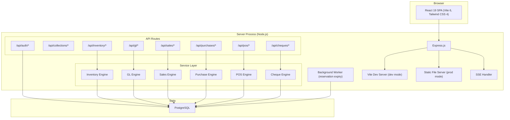

# Infra — Application Stack

## Architecture Pattern

**Monolithic server with modular internal structure** — a single Express.js process serving both the API and the SPA.



### Why not microservices?

| Factor | Monolith | Microservices |
|---|---|---|
| Complexity | Low — single deployment | High — service discovery, network, orchestration |
| Transactions | PostgreSQL transactions across modules | Distributed transactions (saga pattern) |
| Team size | Small (1-3 developers) | Requires per-service ownership |
| Scale needs | Single company, moderate load | Thousands of concurrent users |
| Current codebase | Already monolithic | Would require full rewrite |

**Decision**: Monolith with clean internal module boundaries. If scale demands it in the future, extract modules into services — the service interfaces documented in this vault are designed to make this possible.

## Technology Evolution (IMS Pro → Genius ERP)

| Layer | Current (IMS Pro) | Target (Genius ERP) | Change Needed |
|---|---|---|---|
| Frontend | React 19 + Vite 6 + Tailwind 4 | Same | No change |
| Backend | Express.js + TypeScript | Same | No change |
| Database | SQLite (better-sqlite3) | PostgreSQL | **Migration required** |
| DB Client | better-sqlite3 API | `pg` or Drizzle ORM | **New library** |
| Auth | JWT (bcryptjs + jsonwebtoken) | Same + permission system | **Permission tables + middleware** |
| Real-time | SSE | Same | No change |
| Animations | Framer Motion | Same | No change |
| AI | Gemini API | Same (optional) | No change |

## Local Development

```bash
# Prerequisites
# 1. Node.js 20+
# 2. PostgreSQL 16+ (local or Docker)

# Start PostgreSQL via Docker (recommended)
docker run -d --name genius-pg -p 5432:5432 \
  -e POSTGRES_USER=genius \
  -e POSTGRES_PASSWORD=genius \
  -e POSTGRES_DB=genius_erp \
  postgres:16-alpine

# Install dependencies
npm install

# Run migrations
npm run migrate

# Start dev server
npm run dev
```

## Deployment

For production:
- Build: `npm run build` (Vite produces `dist/`)
- Server: `node dist/server.js` (serves static + API)
- Database: PostgreSQL instance (managed or self-hosted)
- Reverse proxy: Nginx or Caddy recommended for TLS + gzip

## Related Notes

- [[System Overview]]
- [[ADR-001 Database Migration to PostgreSQL]]
- [[Security - Auth and Permissions]]
