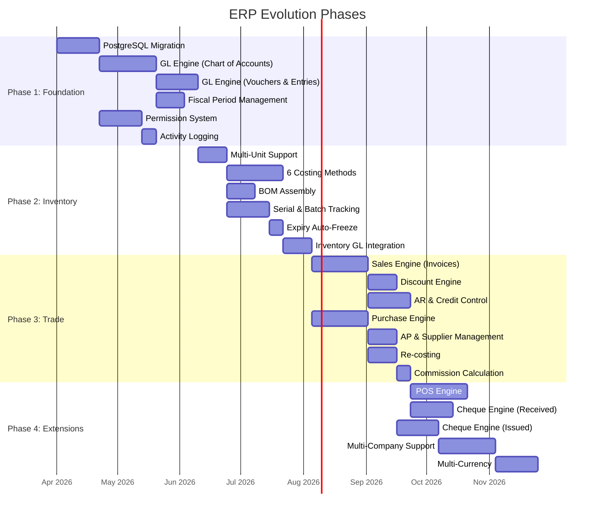

# Phase Plan — Evolution Roadmap

## Summary

The IMS Pro → Genius ERP evolution is delivered in **four phases**, each producing a deployable increment.

---

## Phase 1: Foundation

**Goal**: Migrate infrastructure and build the general ledger — the financial backbone that everything else depends on.

### Deliverables

| Item | Description |
|---|---|
| PostgreSQL migration | Move all 17 tables from SQLite to PostgreSQL; update db.ts to use `pg` client |
| Chart of Accounts | Hierarchical account tree with CRUD, account groups, cost centers |
| Voucher Types | Configurable voucher/invoice types with auto-sequencing |
| Journal Entries | Double-entry posting, validation (balanced debits/credits), journal book UI |
| Fiscal Periods | Create, open, close, rollover. Historical period access |
| Permission System | Permission matrix (module × screen × operation), enforcement middleware |
| Activity Logging | All user actions logged with timestamps and details |

### Existing IMS Pro Impact
- **Database changes everywhere** — all routes updated from `better-sqlite3` API to `pg`
- **Auth routes enhanced** — new permission tables and middleware
- **Existing functionality preserved** — all current features continue working on PostgreSQL

---

## Phase 2: Inventory Evolution

**Goal**: Upgrade the existing inventory system to match the Genius specification.

### Deliverables

| Item                 | Description                                                                   |
| -------------------- | ----------------------------------------------------------------------------- |
| Multi-Unit           | Units of measure per variant with conversion factors                          |
| Cost Layers          | Replace simple weighted average with full cost layer architecture (6 methods) |
| BOM / Assembly       | Define assembly formulas, assemble/disassemble operations                     |
| Serial Tracking      | Serial number assignment on receipt, tracking through sale                    |
| Batch / Expiry       | Batch tracking with expiry dates, auto-freeze worker                          |
| Reorder Alerts       | Min/max/reorder point with dashboard alerts                                   |
| Slow-Moving Analysis | Sales velocity tracking with dormant stock reports                            |
| GL Integration       | Stock movements automatically post journal entries to the GL                  |

### Existing IMS Pro Impact
- **Extends** existing `inventory_balances`, `stock_movements`, `product_variants` tables
- **New tables**: `cost_layers`, `item_units`, `serial_numbers`, `assembly_formulas`
- **Inventory routes** updated for new operations (assembly, serial tracking)
- **Dashboard** enhanced with reorder alerts and slow-moving items

---

## Phase 3: Trade Modules

**Goal**: Build the full sales and purchasing cycles with AR/AP management.

### Deliverables

| Item | Description |
|---|---|
| Sales Invoices | Full lifecycle (draft → confirmed → posted) with auto-GL posting |
| Discount Engine | 5 discount types applied in order, configurable per customer |
| Price Levels | 3 price levels per item, customer-tier autoselection |
| Proforma Invoices | Quotations that convert to sales invoices |
| AR Management | Full receivables tracking, aging reports, payment scheduling |
| Credit Control | Cash + cheque credit limits, block/warn modes |
| Sales Commission | Auto-calculate per rep, configurable rates per item |
| Purchase Invoices | Full lifecycle with auto-GL and auto-inventory posting |
| Purchase Orders | PO creation, tracking, receiving |
| AP Management | Full payables tracking, aging reports |
| Supplier-Customer Link | AR/AP offset for entities that are both supplier and customer |
| Re-costing | Adjust historical cost layers when purchase prices change |

### Existing IMS Pro Impact
- **Replaces** current buy/sell routes with the proper Sales and Purchase engines
- **Evolves** existing invoice tables with new fields (discount details, price level, proforma link)
- **New tables**: `discount_rules`, `price_levels`, `credit_limits`, `commission_rates`

---

## Phase 4: Extensions

**Goal**: Add POS, Cheques, and multi-company support.

### Deliverables

| Item | Description |
|---|---|
| POS | Fast retail UI, barcode scanning, cash drawer, suspended invoices, end-of-day |
| Cheques (Received) | Full lifecycle: receive → deposit/endorse → settle/return |
| Cheques (Issued) | Full lifecycle: issue → settle/return/cancel |
| Cheque Printing | Auto-print with configurable endorsement clauses |
| Multi-Company | Schema-per-company, company registry, company switching UI |
| Multi-Currency | Currency definitions, exchange rates, foreign currency GL entries |

### Existing IMS Pro Impact
- **New pages and components** for POS and Cheque management
- **Schema migration tooling** for multi-company support
- **Sidebar/navigation** updated with new module entries

## Related Notes

- [[ADR-002 Phased Module Rollout]]
- [[System Overview]]
- [[Service - GL Engine]]
- [[Service - Inventory Engine]]
- [[Service - Sales Engine]]
- [[Service - Purchase Engine]]
- [[Service - POS Engine]]
- [[Service - Cheque Engine]]
