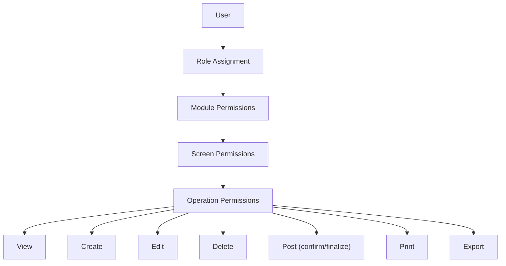
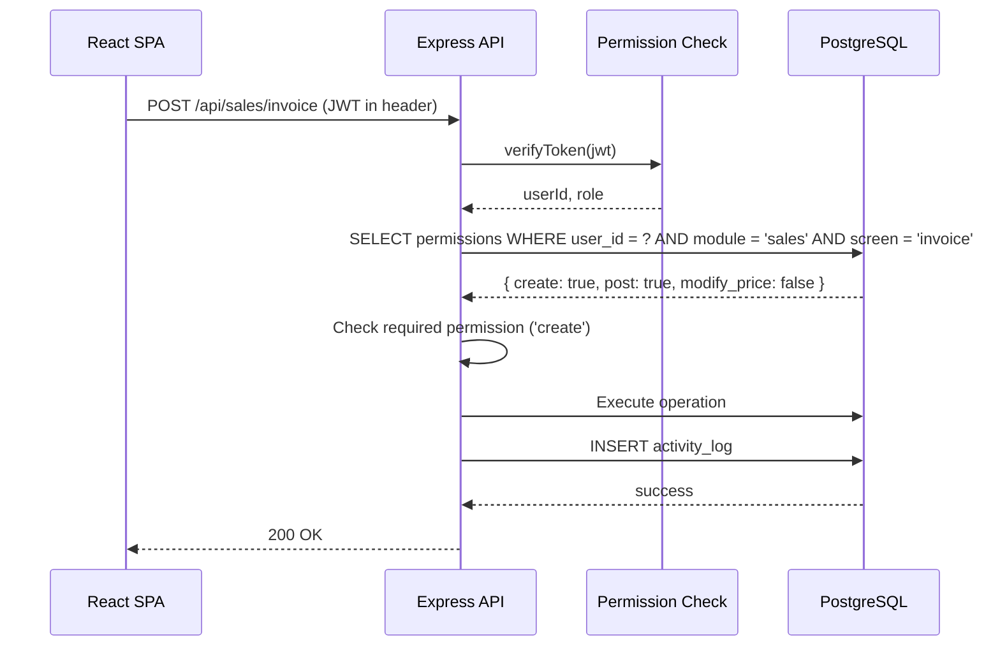

# Security — Auth and Permissions

## Authentication

### Current State (IMS Pro)
- **Mechanism**: JWT tokens (jsonwebtoken + bcryptjs)
- **Flow**: `POST /api/auth/login` → validate credentials → return JWT
- **Session**: Stateless — token stored in browser localStorage
- **Roles**: 3 fixed roles (`admin`, `manager`, `worker`)

### Target State (Genius ERP)
The authentication mechanism is preserved (JWT), but the **authorization** model is significantly expanded.

## Authorization — Granular Permissions

The Genius specification requires **two security screens**:

### 1. Permissions Screen (شاشة الصالحيات)

Every user has granular permissions controlling access to **each module, each screen, and each operation** within that screen.

#### Permission Matrix Structure

| Dimension | Description |
|---|---|
| Module | GL, Inventory, Sales, POS, Purchases, Cheques |
| Screen | Each screen within a module (e.g., "Sales Invoice", "Customer List") |
| Operation | view, create, edit, delete, post, print, export |

#### Custom Permissions for Sales

| Permission | Description |
|---|---|
| `modify_price` | Can change unit price on invoice |
| `apply_discount` | Can apply discounts |
| `apply_bonus` | Can add bonus units |
| `exceed_credit_limit` | Can override credit limit warning |

### 2. Activity Log Screen (شاشة الحركات)

Tracks **every user action** with:
- Login / logout timestamps
- Actions performed (create, edit, delete, post)
- Entity affected
- Before/after values (for edits)

## Permission Enforcement

Permissions are enforced at **two levels**:

1. **API middleware**: Every route checks the user's permission before executing
2. **Frontend UI**: Buttons/screens are hidden or disabled based on permission (defense in depth — backend always validates)

## User Environment

Each user can have a configured **working environment** that defaults certain behaviors:
- Default warehouse
- Price modification allowed (yes/no)
- Discount allowed (yes/no)
- Bonus allowed (yes/no)

This is separate from permissions — it's a convenience setting that pre-selects values and hides controls the user doesn't need.

## Multi-Company Security

In the multi-company model ([[ADR-003 Multi-Company Architecture]]):
- Users are defined in the `public` schema (shared across companies)
- Permissions are per-user **per-company** — a user may be admin in Company A but viewer in Company B
- The `company_id` in the session determines which permission set is active

## Related Notes

- [[System Overview]]
- [[ADR-003 Multi-Company Architecture]]
- [[Service - GL Engine]]
- [[Infra - Application Stack]]
- [[Edge - Unauthorized Access Attempt]]
