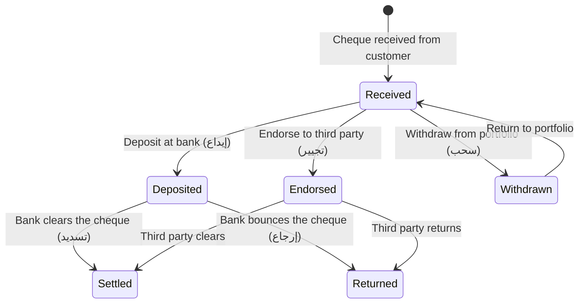
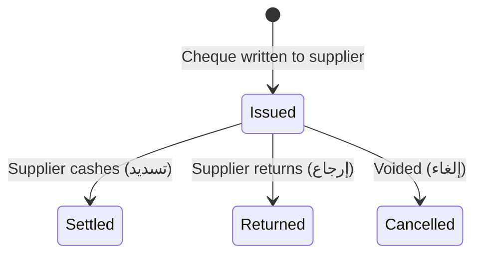

# Service — Cheque Engine

## Responsibility

Manages the full lifecycle of **received (incoming) and issued (outgoing) cheques**, with automatic GL journal entry generation.

### Owns
- Bank account definitions
- Received cheque register
- Issued cheque register
- Cheque lifecycle state machine
- Cheque printing templates

### Delegates To
- [[Service - GL Engine]] — auto-posts journal entries for every cheque state transition
- [[Service - Sales Engine]] — received cheques can be entered from Sales/AR
- [[Service - Purchase Engine]] — issued cheques can be entered from Purchases/AP

## Cheque Lifecycle — Received Cheques

## Cheque Lifecycle — Issued Cheques

## GL Auto-Entries

Every state transition generates automatic journal entries:

### Received Cheque Transitions

| Transition | Debit | Credit |
|---|---|---|
| Received | Cheques Receivable | Accounts Receivable |
| Deposited | Cheques Under Collection | Cheques Receivable |
| Settled (cleared) | Bank Account | Cheques Under Collection |
| Returned (bounced) | Accounts Receivable | Cheques Under Collection |
| Endorsed | Cheques Endorsed | Cheques Receivable |

### Issued Cheque Transitions

| Transition | Debit | Credit |
|---|---|---|
| Issued | Accounts Payable | Cheques Payable |
| Settled (cashed) | Cheques Payable | Bank Account |
| Returned | Cheques Payable | Accounts Payable |
| Cancelled | Cheques Payable | Accounts Payable |

## Batch Operations

Cheque operations can be performed in **bulk** — multiple received cheques can be deposited/endorsed/withdrawn in a single batch operation, generating a single compound journal entry.

## Cheque Printing

Issued cheques can be auto-printed with configurable clauses:
- "Payable to first beneficiary only" (يصرف للمستفيد الأول)
- "Account payee only" (في الحساب)
- "On date" (يصرف بتاريخه)

## Cheque Inquiry

Both received and issued cheques are queryable by:
- Any cheque attribute (number, amount, date, payee, bank)
- Current lifecycle state
- Last transition type

## Related Notes

- [[Service - GL Engine]]
- [[Service - Sales Engine]]
- [[Service - Purchase Engine]]
- [[Domain - Chart of Accounts]]
