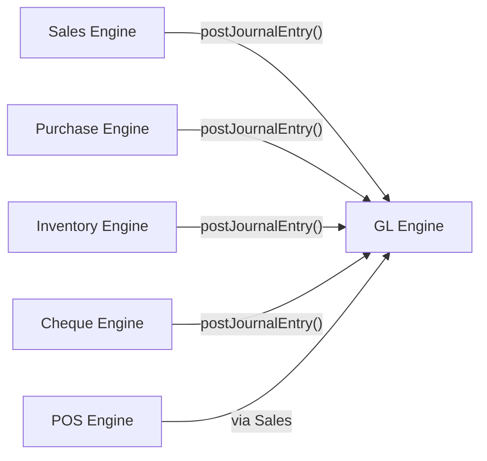

# Service — GL Engine

## Responsibility

The **General Ledger Engine** is the financial backbone of the ERP. It is the **single source of truth** for all financial postings. Every module that creates a financial transaction (Sales, Purchases, Cheques, Inventory adjustments) must post a journal entry through this service.

### Owns
- Chart of Accounts (tree structure)
- Account Groups
- Voucher Type definitions + sequence control
- Journal Entries (GL postings)
- Fiscal Period management (open/close/rollover)
- Cost Center / Profit Center definitions
- Budget definitions (for performance appraisal)

### Does NOT Own
- Customer/supplier master data → see [[Service - Sales Engine]], [[Service - Purchase Engine]]
- Inventory balances → see [[Service - Inventory Engine]]
- Invoice documents → see [[Domain - Invoice]]

## Interface

### Inbound Operations

| Operation | Caller | Description |
|---|---|---|
| `postJournalEntry(lines[])` | All modules | Post a balanced debit/credit entry |
| `reverseEntry(entryId)` | All modules | Create a reversal entry |
| `createAccount(account)` | Admin UI | Add node to chart of accounts |
| `openFiscalPeriod(dates)` | Admin UI | Open a new fiscal year/period |
| `closeFiscalPeriod(periodId)` | Admin UI | Close period, optionally rollover balances |

### Outbound Events (future)

| Event | Description |
|---|---|
| `gl.entry.posted` | A new journal entry was posted |
| `gl.period.closed` | A fiscal period was closed |

## Data Owned

| Store | Type | Purpose |
|---|---|---|
| `accounts` | PostgreSQL table | Chart of accounts tree |
| `account_groups` | PostgreSQL table | Groupings for cross-account tracking |
| `gl_entries` | PostgreSQL table | Journal entry headers |
| `gl_entry_lines` | PostgreSQL table | Individual debit/credit lines |
| `voucher_types` | PostgreSQL table | Invoice/voucher type definitions |
| `voucher_sequences` | PostgreSQL table | Auto-numbering sequences |
| `fiscal_periods` | PostgreSQL table | Fiscal year/period definitions |
| `cost_centers` | PostgreSQL table | Cost/profit center definitions |
| `budgets` | PostgreSQL table | Budget amounts per account per period |

## Key Flows

- [[Flow - Journal Entry Posting]]
- [[Flow - Fiscal Period Close]]
- [[Flow - Budget vs Actual Report]]

## Reports Produced

| Report | Arabic | Description |
|---|---|---|
| Trial Balance | ميزان مراجعة | All account balances for a period |
| Account Statement | كشف حساب تفصيلي | Detailed transactions for one account |
| Cost Center Statement | كشف مراكز التكلفة | Balances by cost center |
| Balance by Currency | أرصدة بالعملات | Account balances broken down by currency |
| Operating Statement | بيان التشغيل | Operating income/expense summary |
| Trading Statement | بيان المتاجرة | Trading account (purchases vs. sales) |
| Profit & Loss | الأرباح والخسائر | Revenue minus expenses |
| Income Statement | قائمة الدخل | Detailed income statement |
| Balance Sheet | الميزانية العمومية | Assets, liabilities, equity snapshot |
| Budget vs. Actual | مقارنة الفعلي بالتقديري | Performance appraisal report |

## Failure Strategy

- **Database down**: Return 503 on all write operations. Read operations can serve cached trial balance if available.
- **Unbalanced entry**: Reject at the API level — `SUM(debits) MUST == SUM(credits)` is validated before insertion.
- **Closed period posting**: Reject any entry targeting a closed fiscal period.

## Related Notes

- [[Domain - Chart of Accounts]]
- [[Domain - Voucher Type]]
- [[Domain - Fiscal Period]]
- [[Domain - Cost Center]]
- [[ADR-001 Database Migration to PostgreSQL]]
