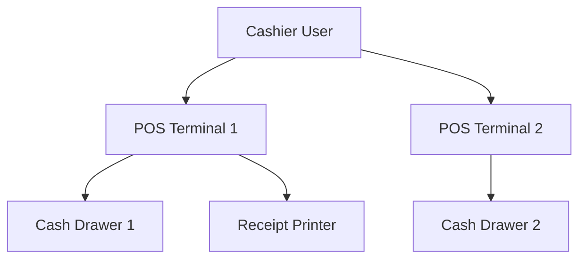
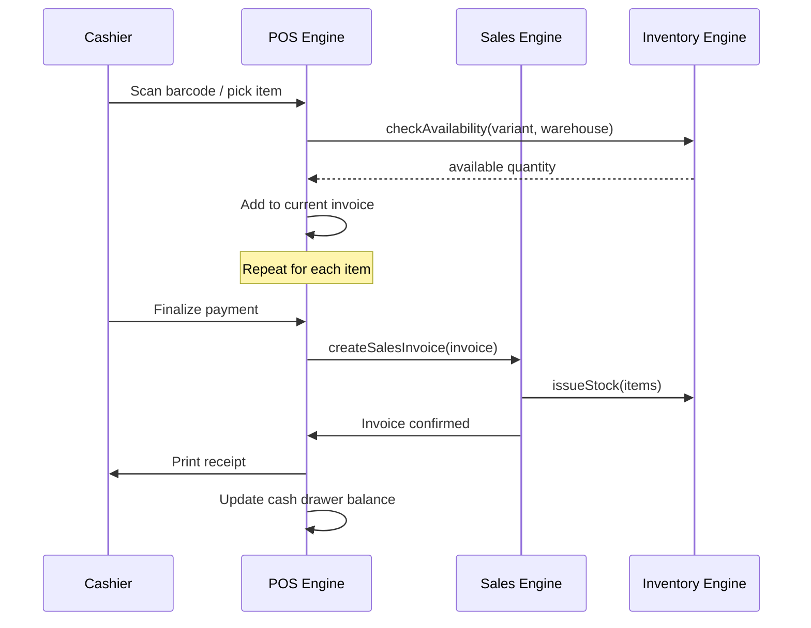

# Service — POS Engine

## Responsibility

A **specialized extension** of the Sales Engine optimized for fast retail operations. It provides a streamlined UI and workflow for high-volume, barcode-driven sales.

### Owns
- POS terminal definitions (multiple terminals per user)
- Cash drawer state (opening balance, current balance)
- Suspended invoice queue
- POS receipt format and printing
- End-of-day cash clearance

### Delegates To
- [[Service - Sales Engine]] — for actual invoice creation and AR posting
- [[Service - Inventory Engine]] — for stock checks and issuance
- [[Service - GL Engine]] — indirectly via Sales Engine

## Key Features

| Feature | Description |
|---|---|
| Barcode Scanning | Scan-to-add items, including barcode scale labels for weighted items |
| Multi-Currency | Accept payment in multiple currencies; compute change in base currency |
| Suspended Invoices | Park incomplete invoices and recall them later (unlimited) |
| Credit Sales from POS | Create receivable invoices (not just cash) |
| Sales Returns | Process returns with permission-based price override |
| Quick-Pick List | On-screen grid for non-barcoded items |
| Cash Drawer Tracking | Real-time cash balance visible to user |
| End-of-Day Clearance | Zero the drawer, generate summary report |

## POS Terminal Model

Multiple terminals can be assigned to a single user for simplified cash reconciliation.

## POS Transaction Flow

## End-of-Day Clearance

1. Cashier initiates "Clear Drawer" action
2. System calculates expected cash = opening balance + cash sales − cash returns − cash payments out
3. Cashier enters actual counted cash
4. System records the variance (overage/shortage)
5. Summary report is generated showing all transactions for the shift

## Related Notes

- [[Service - Sales Engine]]
- [[Service - Inventory Engine]]
- [[Domain - Invoice]]
