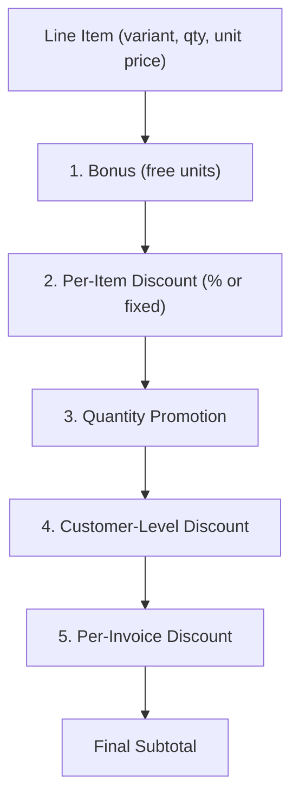

# Service — Sales Engine

## Responsibility

Manages the **entire sales lifecycle** — from quotation to delivery to payment collection — and tracks **Accounts Receivable** (AR).

### Owns
- Customer / Client master data
- Sales Invoices, Returns, Proforma Invoices
- Discount rules (per-item, per-invoice, bonus, per-customer, quantity promotions)
- Price levels (3 levels per item)
- AR balances and aging
- Sales rep assignments and commission calculations
- Customer credit limits (cash + cheque)

### Does NOT Own
- Product/variant data → [[Service - Inventory Engine]]
- GL accounts → [[Service - GL Engine]]
- Cheque lifecycle → [[Service - Cheque Engine]]

## Interface

### Inbound Operations

| Operation | Caller | Description |
|---|---|---|
| `createSalesInvoice(invoice)` | Sales UI | Create and post a sales invoice |
| `createSalesReturn(return)` | Returns UI | Process a customer return |
| `createProforma(proforma)` | Sales UI | Create a quotation/sales order |
| `convertProformaToInvoice(proformaId)` | Sales UI | Convert quotation to invoice |
| `recordPayment(clientId, amount, method)` | Payments UI | Record incoming payment |
| `setCustomerCreditLimit(clientId, cashLimit, chequeLimit)` | Admin UI | Set credit ceilings |

### Queries

| Query | Description |
|---|---|
| `getClientBalance(clientId)` | Current AR balance |
| `getAgedReceivables(asOfDate)` | AR aging report |
| `getClientPaymentHistory(clientId)` | Payment ledger |
| `getSalesReport(filters)` | Invoice listing with filters |
| `getTaxReport(period)` | VAT summary/detail per invoice |
| `getCommissionReport(repId, period)` | Sales rep commission calculation |
| `getInactiveClients(days)` | Clients with no activity in N days |

## Discount Engine

When processing a sales invoice, discounts are applied in this order:

## Price Levels

Three price levels per item, selected based on:
1. **Item default price** — base selling price
2. **Customer-specific price** — override per customer tier
3. **Last invoice price** — auto-fill from customer's previous purchase

## Credit Control

Before confirming a sales invoice:
1. Check `current_AR_balance + invoice_total <= cash_credit_limit`
2. Check `outstanding_uncollected_cheques + cheque_amount <= cheque_credit_limit`
3. If exceeded: **block** or **warn** (configurable per customer)

## GL Integration

On invoice posting:

| Account | Debit | Credit |
|---|---|---|
| Accounts Receivable | invoice total | — |
| Sales Revenue | — | subtotal |
| VAT Payable | — | tax amount |
| COGS | cogs amount | — |
| Inventory | — | cogs amount |

On payment receipt:

| Account | Debit | Credit |
|---|---|---|
| Cash / Bank | payment amount | — |
| Accounts Receivable | — | payment amount |

## Failure Strategy

- **Credit limit exceeded**: Block or warn (configurable), log the attempt.
- **Insufficient stock**: Delegate to Inventory Engine — reject if stock unavailable.
- **Concurrent invoice**: Idempotency key prevents duplicate submissions.

## Related Notes

- [[Domain - Invoice]]
- [[Service - GL Engine]]
- [[Service - Inventory Engine]]
- [[Service - POS Engine]]
- [[Service - Cheque Engine]]
- [[Security - Auth and Permissions]]
