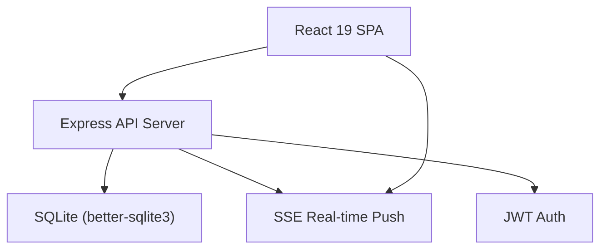
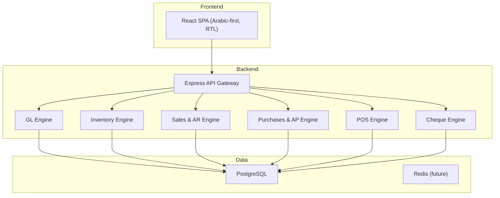
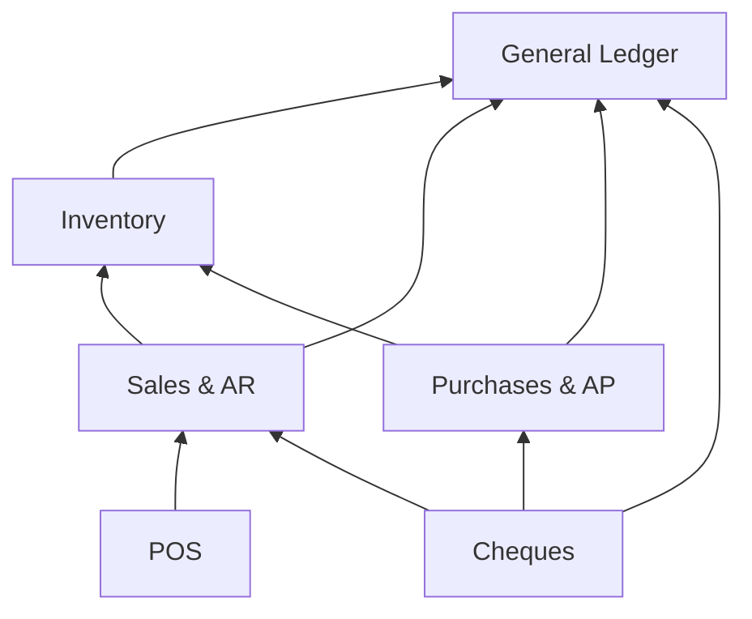

# System Overview

## Vision

Evolve the existing **IMS Pro** inventory management system into a full-featured **ERP** platform matching the **Genius Systems** specification. The target is a modular, web-based, Arabic-first ERP that begins as a single-company deployment and is architected from day one for **multi-company** expansion.

## Current State (IMS Pro — As-Is)

| Dimension | Current State |
|---|---|
| Frontend | React 19, Vite 6, Tailwind CSS 4, Framer Motion |
| Backend | Express.js + tsx (TypeScript) |
| Database | SQLite (single file: `ims-pro.db`) |
| Auth | JWT (bcryptjs + jsonwebtoken) |
| Real-time | Server-Sent Events (SSE) |
| Tables | 17 tables (users, warehouses, brands, categories, suppliers, clients, products, product_variants, inventory_balances, stock_movements, reservations, transfers, revenue_invoices, purchase_invoices, transfer_invoices, return_invoices, client_payments, warehouse_expenses, inventory_update_records, supplier_product_relations) |
| Modules | Inventory, Buy/Sell, Returns, Warehouse Expenses, Accounting Reports (P&L, Aged AR/AP, Cash Flow, VAT) |
| AI | Google Gemini API for demand forecasting & insights |

## Target State (Genius ERP — To-Be)

### Six Core Modules

| #   | Module                           | Owner                          | Description                                                     |
| --- | -------------------------------- | ------------------------------ | --------------------------------------------------------------- |
| 1   | **General Ledger / Accounting**  | [[Service - GL Engine]]        | Chart of accounts, vouchers, journal entries, financial reports |
| 2   | **Warehouse / Inventory**        | [[Service - Inventory Engine]] | Multi-store, 6 costing methods, BOM, expiry, serial tracking    |
| 3   | **Sales & Accounts Receivable**  | [[Service - Sales Engine]]     | Invoices, returns, proformas, discounts, AR aging, commissions  |
| 4   | **Point of Sale**                | [[Service - POS Engine]]       | Fast retail, barcode, cash drawer, suspended invoices           |
| 5   | **Purchases & Accounts Payable** | [[Service - Purchase Engine]]  | PO, receipts, returns, AP aging, supplier management            |
| 6   | **Cheque Management**            | [[Service - Cheque Engine]]    | Issued/received cheques, endorsement, deposit, settlement       |
|     |                                  |                                |                                                                 |

### Cross-Cutting Concerns

| Concern                             | Notes                                                                            |
| ----------------------------------- | -------------------------------------------------------------------------------- |
| [[Security - Auth and Permissions]] | Per-user, per-screen, per-module permissions + activity log                      |
| Multi-Company                       | Tenant isolation at DB schema level → see [[ADR-003 Multi-Company Architecture]] |
| Multi-Currency                      | Base currency + conversion factor per currency → see [[Domain - Currency]]       |
| Taxes                               | Percentage, fixed, formula, compound → see [[Domain - Tax]]                      |
| Fiscal Years                        | Flexible start, multi-period, balance rollover → see [[Domain - Fiscal Period]]  |
| Reports                             | All exportable to Excel, customizable parameters                                 |
| Performance Appraisal               | Budget vs. actual, entity performance scoring                                    |
| Voucher/Invoice Sequencing          | Configurable types + controlled sequential numbering                             |
| RTL / i18n                          | Arabic-first UI, bilingual data entry (Arabic + English)                         |

## Key Constraints

1. **Web-based** — must run in any modern browser
2. **PostgreSQL** — replacing SQLite for production readiness
3. **Single-company first** — but schema must be multi-company-ready from day one
4. **Phased rollout** — modules delivered incrementally, not all at once
5. **Evolution, not rewrite** — preserve working IMS Pro patterns (React, Express, SSE, JWT)
6. **No external integrations** — no payment gateways, tax APIs, or eCommerce for now

## Module Dependency Graph

> **Reading direction**: An arrow from A → B means "A depends on B" (A posts entries to B).

## Evolution Roadmap

See [[Phase Plan - Evolution Roadmap]] for the phased delivery plan.

## Related Notes

- [[ADR-001 Database Migration to PostgreSQL]]
- [[ADR-002 Phased Module Rollout]]
- [[ADR-003 Multi-Company Architecture]]
- [[ADR-004 Costing Engine Strategy]]
- [[Service - GL Engine]]
- [[Service - Inventory Engine]]
- [[Service - Sales Engine]]
- [[Service - POS Engine]]
- [[Service - Purchase Engine]]
- [[Service - Cheque Engine]]
- [[Security - Auth and Permissions]]
- [[Infra - Application Stack]]
- [[Glossary]]
