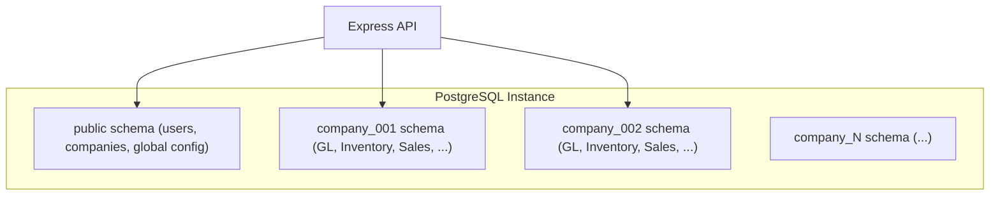

# ADR-003 — Multi-Company Architecture

## Context

The Genius specification requires **unlimited companies on the same instance**, each with independent data (chart of accounts, vouchers, invoices, etc.), and seamless switching between companies without logging out.

The system must launch with a single company but be architecturally ready for multi-company from day one.

## Decision

Use **PostgreSQL schema-based multi-tenancy**. Each company gets its own PostgreSQL schema. A shared `public` schema holds cross-company data (system users, company registry, global config).

### Schema Selection

Every API request carries a `company_id` header (or is inferred from the user's session). The server sets `SET search_path TO company_XXX, public` at the start of each request/transaction.

### Single-Company Phase

During single-company mode, there is one schema: `company_default`. The system behaves identically to a non-multi-tenant app, but the schema boundary is already in place.

## Alternatives Considered

### Why not row-level tenancy (shared tables with company_id column)?
- Every query needs a `WHERE company_id = ?` filter — risk of data leakage if forgotten
- Indexing complexity increases (every index must include `company_id`)
- Chart of accounts, voucher sequences, and fiscal years are structurally different per company — shared tables become awkward
- Harder to export/backup a single company's data

### Why not separate databases per company?
- Connection pool overhead (one pool per database)
- Cross-company reporting (e.g., consolidated financial statements) becomes cross-database joins
- More complex migration management (must run migrations on every database)

### Why not application-level isolation (separate app instances)?
- Resource wasteful — each company needs its own server process
- Defeats the specification's "seamless switching without logout" requirement
- Operational complexity scales linearly with company count

## Consequences

### Positive
- Clean data isolation with zero risk of cross-company leakage
- Company backup/restore is simply `pg_dump --schema=company_XXX`
- Schema migrations can be applied per-company (useful for staged rollouts)
- `search_path` based routing is transparent to application queries

### Negative
- Schema proliferation — must manage N schemas (but PostgreSQL handles this efficiently)
- Migration scripts must loop over all schemas
- Cross-company consolidated reports require `UNION` across schemas or a reporting schema

## Related Notes

- [[System Overview]]
- [[ADR-001 Database Migration to PostgreSQL]]
- [[Domain - Company]]
- [[Security - Auth and Permissions]]
