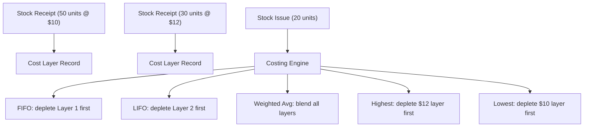

# ADR-004 — Costing Engine Strategy

## Context

The Genius specification mandates **six inventory costing methods**:

1. **Weighted Average** — current IMS Pro method
2. **Batches** — cost tracked per batch/lot
3. **FIFO** (First In, First Out)
4. **LIFO** (Last In, First Out)
5. **Highest Cost** — deplete highest-cost layers first
6. **Lowest Cost** — deplete lowest-cost layers first

The costing method is configured **per warehouse** (not per item or globally), allowing different warehouses within the same company to use different methods.

Additionally, **re-costing** must be supported — recalculating COGS for historical purchase invoices after confirmation, with automatic accounting journal adjustments.

## Decision

Implement a **cost layer architecture** with a pluggable costing strategy.

### Core Concept: Cost Layers

Every stock receipt creates a **cost layer** — a record of quantity received at a specific unit cost. When stock is issued (sold, transferred, written off), the costing engine selects which cost layers to deplete based on the warehouse's costing method.

### Cost Layer Table

| Column | Type | Description |
|---|---|---|
| id | UUID | Primary key |
| variant_id | TEXT | Product variant |
| warehouse_id | TEXT | Warehouse owning this layer |
| batch_id | TEXT | Optional batch/lot reference |
| quantity_received | DECIMAL | Original quantity in this layer |
| quantity_remaining | DECIMAL | Undepleted quantity |
| unit_cost | DECIMAL | Cost per unit in this layer |
| receipt_date | TIMESTAMP | When this layer was created |
| source_invoice_id | TEXT | Purchase invoice that created this layer |

### Strategy Pattern

Each costing method is a **strategy** that implements a single operation: "Given a requested issue quantity, return the list of cost layer depletions."

| Method | Layer Selection Logic |
|---|---|
| Weighted Average | No layer selection — compute `SUM(remaining × cost) / SUM(remaining)` |
| FIFO | Order layers by `receipt_date ASC`, deplete oldest first |
| LIFO | Order layers by `receipt_date DESC`, deplete newest first |
| Highest Cost | Order layers by `unit_cost DESC`, deplete highest first |
| Lowest Cost | Order layers by `unit_cost ASC`, deplete lowest first |
| Batches | User selects specific batch; deplete that batch's layer |

## Alternatives Considered

### Why not a single weighted average (as IMS Pro does today)?
- Specification explicitly requires 6 methods
- Businesses in different industries need different methods (retail → weighted average; pharma → FIFO/batch for expiry; luxury → specific identification)

### Why not calculate COGS on-the-fly from movement history?
- Scanning all movements for every sale is O(N) per transaction — unacceptable at scale
- Cost layers are pre-computed and indexed — O(1) to O(log N) per issue
- Re-costing requires clear layer records to recalculate

### Why not implement costing at the item level instead of warehouse level?
- The specification says costing method is per-warehouse
- Same item in "Retail Store A" (weighted average) vs. "Bonded Warehouse B" (FIFO) is a valid business scenario

## Consequences

### Positive
- Single unified data model supports all 6 methods
- Adding new methods in the future requires only a new strategy, not schema changes
- Cost layers enable precise re-costing by replaying depletions
- Batch/lot tracking naturally falls out of the cost layer model (each batch = a layer)

### Negative
- More complex than the current simple weighted average calculation
- Cost layer table grows with every receipt — needs periodic archival for very old, fully depleted layers
- Weighted average becomes a special case that ignores individual layers but must still maintain them for potential method switching

## Related Notes

- [[System Overview]]
- [[Service - Inventory Engine]]
- [[Domain - Item]]
- [[Domain - Cost Layer]]
- [[Flow - Stock Issue with Costing]]
