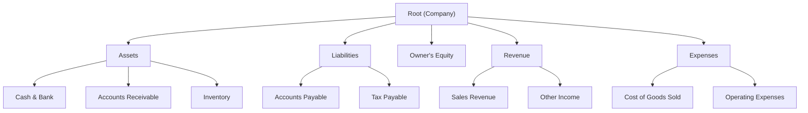
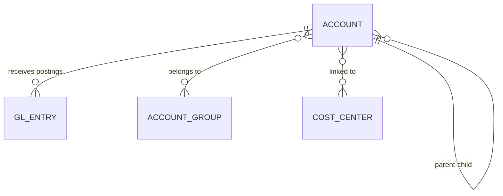

# Domain — Chart of Accounts

## Definition

A **hierarchical tree** of accounts that represents the company's financial structure. Every financial transaction ultimately posts debits and credits to accounts in this tree.

## Ownership

**Single source of truth**: [[Service - GL Engine]]
No other module may create, modify, or delete accounts. Other modules only **reference** account IDs when posting journal entries.

## Structure

## Key Attributes

| Attribute | Type | Description |
|---|---|---|
| id | UUID | Primary key |
| account_code | TEXT | User-defined hierarchical code (e.g., "1-1-001") |
| name_ar | TEXT | Arabic name |
| name_en | TEXT | English name |
| parent_id | UUID | Parent account (null for root-level) |
| account_type | ENUM | `asset`, `liability`, `equity`, `revenue`, `expense` |
| is_leaf | BOOLEAN | Can receive postings (only leaf accounts can) |
| normal_balance | ENUM | `debit` or `credit` |
| is_active | BOOLEAN | Soft disable |
| currency_id | UUID | Default currency (optional) |
| cost_center_ids | UUID[] | Linked cost centers → see [[Domain - Cost Center]] |

## Business Rules

1. **Free-form tree** — the specification explicitly states "free sequence" (تسلسل حر), meaning the user controls the hierarchy depth and structure
2. **Only leaf accounts** receive journal postings; parent accounts aggregate balances from children
3. An account cannot be deactivated if it has a non-zero balance in the current fiscal period
4. Account codes must be unique within a company
5. Accounts can belong to **account groups** for cross-account tracking (e.g., all accounts related to a specific person or department) → see [[Domain - Account Group]]

## Relationships

## Related Notes

- [[Service - GL Engine]]
- [[Domain - Voucher Type]]
- [[Domain - Fiscal Period]]
- [[Domain - Cost Center]]
- [[Domain - Account Group]]
- [[Flow - Journal Entry Posting]]
