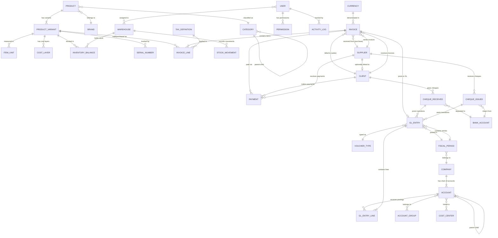

# Domain — Entity Relationship Overview

## Complete ER Diagram

## Table Count Summary

| Module | Tables | New vs. Existing |
|---|---|---|
| **Core / Shared** | companies, users, permissions, activity_log, currencies, tax_definitions | New (except users) |
| **General Ledger** | accounts, account_groups, gl_entries, gl_entry_lines, voucher_types, voucher_sequences, fiscal_periods, cost_centers, budgets | All new |
| **Inventory** | products, product_variants, brands, categories, warehouses, inventory_balances, stock_movements, reservations, cost_layers, item_units, serial_numbers, assembly_formulas | Existing + new |
| **Sales / AR** | revenue_invoices, invoice_lines, transfers, clients, client_payments, discount_rules, price_levels, commission_rates | Existing + new |
| **Purchases / AP** | purchase_invoices, purchase_orders, suppliers, supplier_product_relations | Existing + new |
| **Cheques** | cheques_received, cheques_issued, bank_accounts, cheque_transitions | All new |

**Total estimated tables**: ~40 (up from 17 in IMS Pro)

## Related Notes

- [[Domain - Chart of Accounts]]
- [[Domain - Item]]
- [[Domain - Invoice]]
- [[System Overview]]
