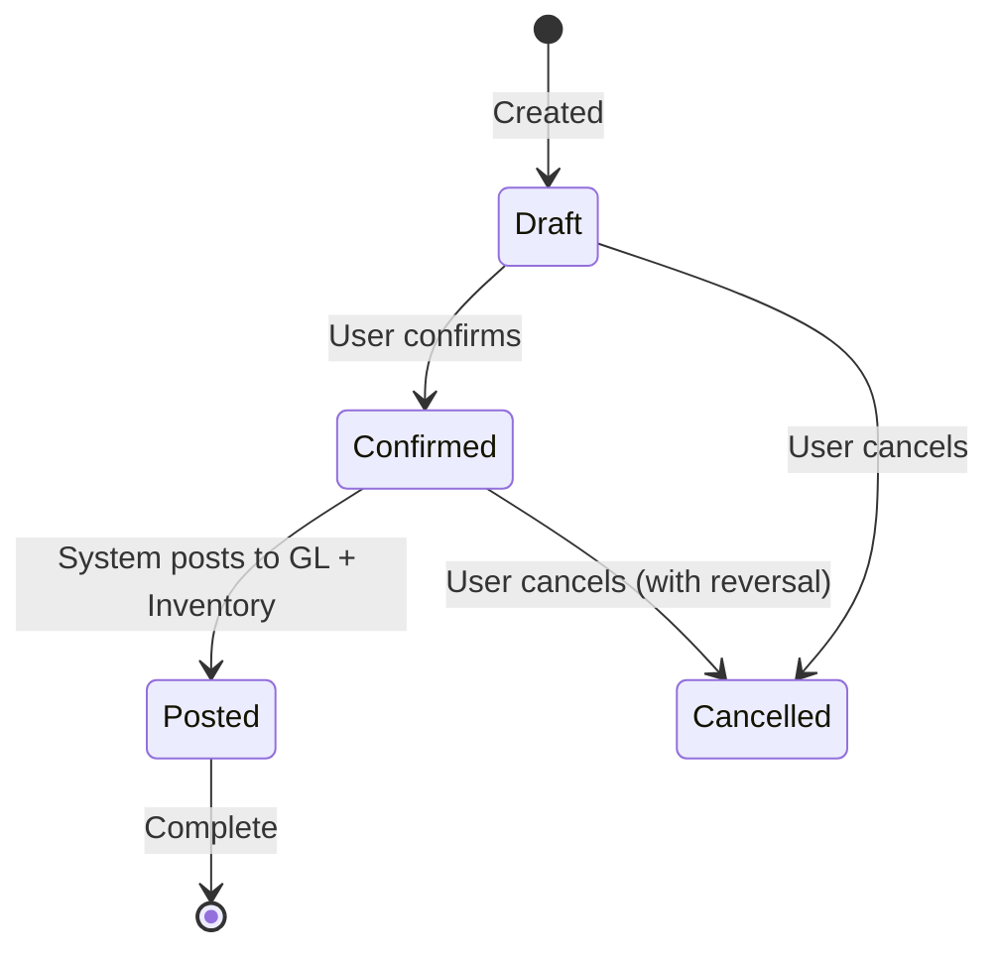

# Domain — Invoice

## Definition

An **Invoice** (فاتورة) is a financial document recording a trade transaction. There are several types, each owned by a different module:

## Invoice Types

| Type | Arabic | Owner | Description |
|---|---|---|---|
| Sales Invoice | فاتورة مبيعات | [[Service - Sales Engine]] | Records sale to customer |
| Sales Return | مردود مبيعات | [[Service - Sales Engine]] | Records return from customer |
| Proforma Invoice | طلب بيع | [[Service - Sales Engine]] | Quotation / sales order (non-financial) |
| Purchase Invoice | فاتورة مشتريات | [[Service - Purchase Engine]] | Records purchase from supplier |
| Purchase Return | مردود مشتريات | [[Service - Purchase Engine]] | Records return to supplier |
| Purchase Order | طلب شراء | [[Service - Purchase Engine]] | Purchase request (non-financial) |
| Transfer Invoice | سند نقل | [[Service - Inventory Engine]] | Records inter-warehouse transfer |
| POS Invoice | فاتورة نقطة بيع | [[Service - POS Engine]] | Fast retail sale receipt |

## Common Invoice Attributes

| Attribute | Type | Description |
|---|---|---|
| id | UUID | Primary key |
| invoice_number | TEXT | Sequential number (per [[Domain - Voucher Type]]) |
| invoice_type | ENUM | Type from table above |
| entity_id | UUID | Customer or supplier ID |
| entity_name | TEXT | Denormalized name |
| items | JSONB | Line items (variant, qty, price, discount, tax) |
| subtotal | DECIMAL | Before tax |
| tax_details | JSONB | Itemized tax breakdown → see [[Domain - Tax]] |
| tax_total | DECIMAL | Total tax amount |
| total_amount | DECIMAL | Final amount after tax |
| discount_details | JSONB | Discount breakdown (per-item, per-invoice, bonus) |
| paid_amount | DECIMAL | Amount paid so far |
| payment_status | ENUM | `pending`, `partial`, `paid`, `cancelled` |
| currency_id | UUID | Transaction currency |
| exchange_rate | DECIMAL | Rate to base currency at time of invoice |
| warehouse_id | UUID | Originating warehouse |
| fiscal_period_id | UUID | The fiscal period this invoice belongs to |
| gl_voucher_id | UUID | Auto-generated journal entry in GL |
| status | ENUM | `draft`, `confirmed`, `posted`, `cancelled` |
| created_by | UUID | User who created it |
| created_at | TIMESTAMP | Creation timestamp |
| posted_at | TIMESTAMP | When posted to GL + inventory |

## Discount Types (Sales)

The specification defines multiple discount types that can be combined:

| Discount Type | Arabic | Scope |
|---|---|---|
| Bonus | بونص | Extra free units on a line item |
| Per-Invoice | خصم إجمالي | Percentage/amount off the entire invoice |
| Per-Item | خصم فردي | Percentage/amount off a specific line item |
| Per-Customer | خصم عميل | Automatic discount based on customer tier |
| Quantity Promotion | عروض على الكميات | Price/discount applied when quantity exceeds threshold |

## Invoice Lifecycle

## Auto-Posting on Confirmation

When a Sales or Purchase invoice is **posted**, the system automatically:
1. Creates a **GL journal entry** (debit/credit to appropriate accounts)
2. Creates an **Inventory stock movement** (issue or receipt)
3. Updates **AR/AP balances** on the customer/supplier

This is the core integration point between modules.

## Voucher Numbering

Each invoice type uses a **voucher type definition** that controls:
- Prefix (e.g., "INV-", "PUR-")
- Starting number
- Step increment
- Sequence boundaries (start/end)
- Whether the sequence can be manually overridden

See [[Domain - Voucher Type]] for details.

## Related Notes

- [[Service - GL Engine]]
- [[Service - Sales Engine]]
- [[Service - Purchase Engine]]
- [[Service - POS Engine]]
- [[Domain - Voucher Type]]
- [[Domain - Tax]]
- [[Domain - Chart of Accounts]]
- [[Flow - Sales Invoice Posting]]
