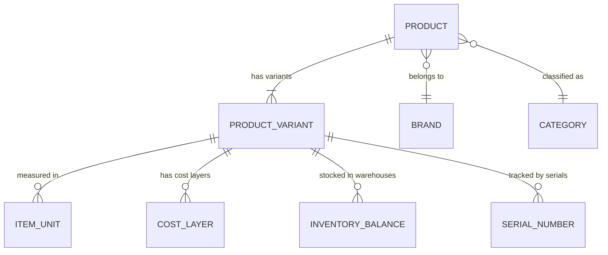

# Domain — Item

## Definition

An **Item** (مادة) is a physical product managed by the inventory system. Items have a hierarchical structure: **Product → Product Variant**.

- **Product**: the generic item (e.g., "iPhone 15 Pro")
- **Product Variant**: a specific SKU-level variant (e.g., "iPhone 15 Pro, 256GB, Blue")

## Ownership

**Single source of truth**: [[Service - Inventory Engine]]

## Key Attributes — Product

| Attribute | Type | Description |
|---|---|---|
| id | UUID | Primary key |
| sku | TEXT | Unique stock-keeping unit |
| name_ar | TEXT | Arabic name |
| name_en | TEXT | English name |
| brand_id | UUID | → [[Domain - Brand]] |
| category_id | UUID | → [[Domain - Category]] |
| description | TEXT | Free-text description |
| image_url | TEXT | Product image |
| country_of_origin | TEXT | Manufacturing country |
| is_assembly | BOOLEAN | Whether this product is a BOM/assembly |
| assembly_formula | JSONB | BOM components if `is_assembly = true` |
| is_active | BOOLEAN | Soft disable |

## Key Attributes — Product Variant

| Attribute | Type | Description |
|---|---|---|
| id | UUID | Primary key |
| product_id | UUID | Parent product |
| variant_code | TEXT | Variant identifier |
| barcode | TEXT | Unique barcode (supports barcode scales) |
| supplier_ref_number | TEXT | Supplier's own reference code |
| color | TEXT | Variant attribute |
| size | TEXT | Variant attribute |
| type | TEXT | Variant attribute |
| attributes | JSONB | Flexible additional attributes |
| reorder_point | DECIMAL | Reorder threshold per warehouse |
| min_quantity | DECIMAL | Minimum stock level |
| max_quantity | DECIMAL | Maximum stock level |
| is_active | BOOLEAN | Soft disable |

## Units

Items support **multiple units of measure** (حبة / كرتونة / لتر / متر / etc.), each with a **conversion factor** against the base unit and an independent selling price.

| Attribute | Type | Description |
|---|---|---|
| id | UUID | Primary key |
| variant_id | UUID | Product variant |
| unit_name | TEXT | Unit name (e.g., "Box", "Piece") |
| conversion_factor | DECIMAL | How many base units = 1 of this unit |
| sell_price | DECIMAL | Selling price per this unit |
| is_base | BOOLEAN | Whether this is the base unit |

## Inventory Tracking Features

1. **Barcode** — every variant has a unique barcode; supports barcode scale labels
2. **Serial Numbers** — tracked via the serial tracking system → see [[Domain - Serial Number]]
3. **Batch / Lot Tracking** — each receipt batch is a [[Domain - Cost Layer]] with expiry dates
4. **Expiry Dates** — tracked per batch; auto-freeze when expired → see [[Edge - Expired Batch Auto-Freeze]]
5. **Assembly / BOM** — a product can be defined as an assembly of component items; disassembly creates component stock from the assembled product
6. **Slow-Moving / Dormant** — system tracks sales velocity per item to flag dormant stock

## Relationships

## Related Notes

- [[Service - Inventory Engine]]
- [[ADR-004 Costing Engine Strategy]]
- [[Domain - Cost Layer]]
- [[Domain - Brand]]
- [[Domain - Category]]
- [[Domain - Serial Number]]
- [[Domain - Warehouse]]
