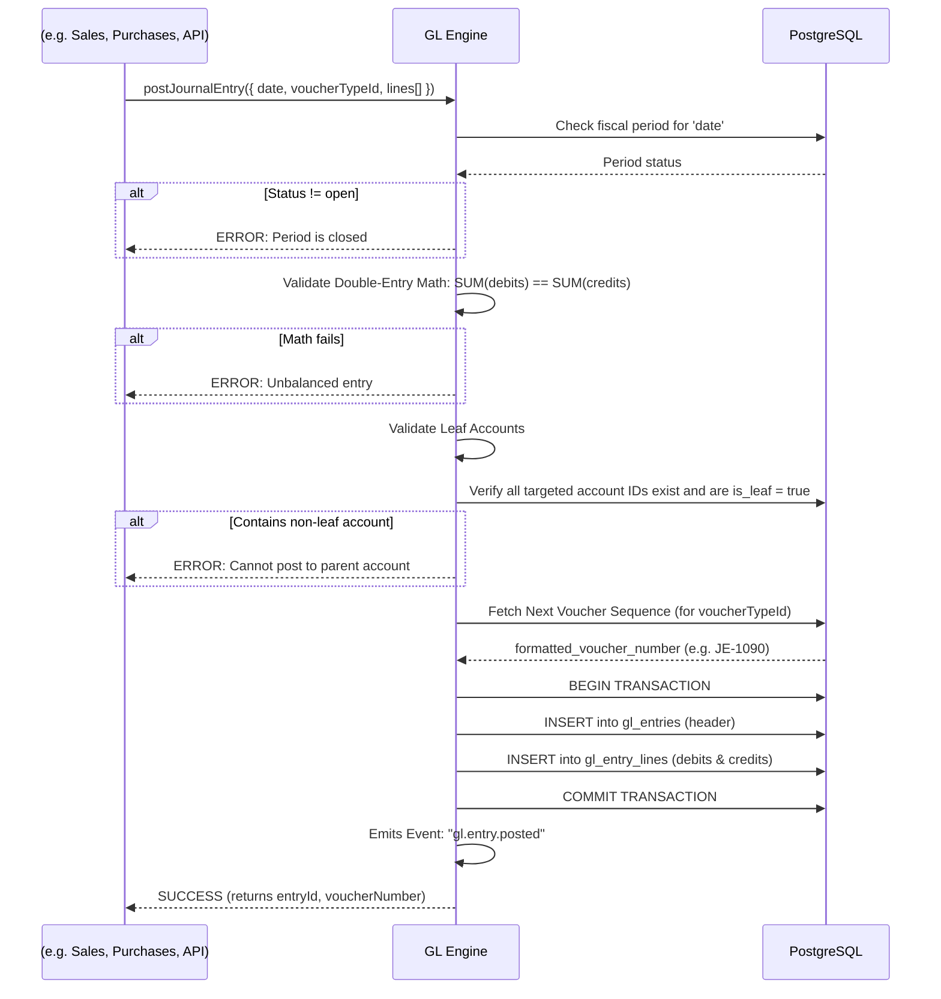

# Flow — Journal Entry Posting

## Overview

This represents the foundational posting mechanism into the **GL Engine**. Almost all other transactional flows (Sales Posting, Receipts, Cheque Settlements) eventually trigger this flow.

## Sequence

## Validations Performed

1. **Date Bounds**: Falls within an `open` fiscal period.
2. **Balance Math**: Total Debits equal Total Credits.
3. **Leaf Only**: Parent accounts are purely for aggregation; only leaf nodes can receive direct inserts.
4. **Currency Handling**: If lines are mixed currency, all must convert to base_currency (via exact exchange rates) and balance in the base currency space.
5. **Cost Centers**: If an account requires Cost Center assignment, validate that the lines provide proportional cost center allocations matching the line total.

## Related Notes

- [[Service - GL Engine]]
- [[Domain - Chart of Accounts]]
- [[Domain - Fiscal Period]]
- [[Flow - Sales Invoice Posting]]
