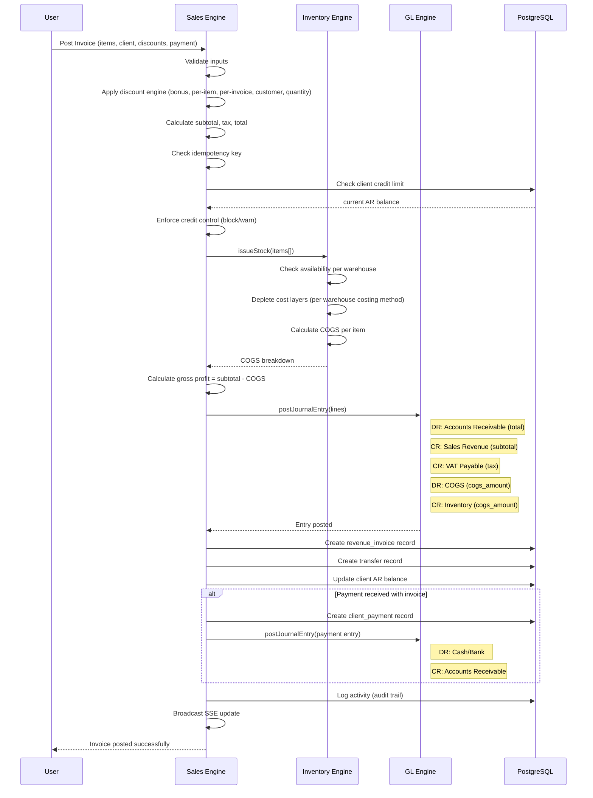

# Flow — Sales Invoice Posting

## Overview

This flow documents what happens when a user posts (confirms) a sales invoice. It is the most cross-cutting flow in the system, touching Sales, Inventory, GL, and AR.

## Actors

- **User**: Sales clerk or authorized user
- **Sales Engine**: Orchestrates the process
- **Inventory Engine**: Deducts stock and calculates COGS
- **GL Engine**: Creates the journal entry

## Sequence

## Transaction Boundary

The **entire flow** executes within a single PostgreSQL transaction. If any step fails (insufficient stock, credit limit exceeded, GL validation error), the entire operation rolls back — no partial state.

## Related Notes

- [[Service - Sales Engine]]
- [[Service - Inventory Engine]]
- [[Service - GL Engine]]
- [[ADR-004 Costing Engine Strategy]]
- [[Domain - Invoice]]
